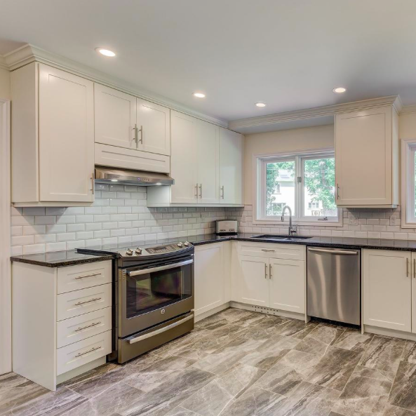
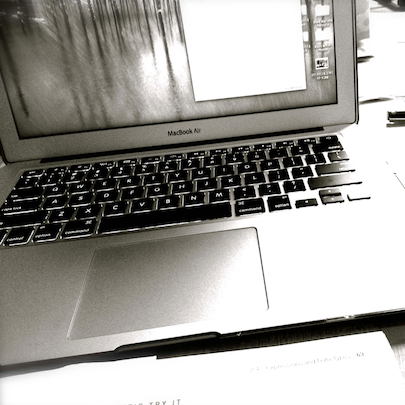
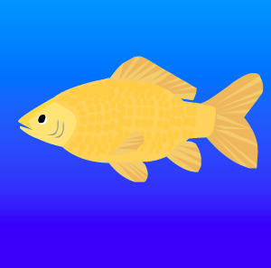

# Welcome to Marlena's GitHub Page

I'm currently a student at Saint Paul College, graduating Spring 2017 with an AAS degree in Computer Programming. My area of emphasis is Web Development, and I am also working toward earning a certificate in Web Design. Please check out some of my projects below. (Click on the image to view that project.)

## Resume

<a href="https://annamarlena.github.io/Resume.pdf">Marlena's Resume</a>

## New! Space Invaders Game
A simple Javascript game I made at Saint Paul College using Tumult Hype. This is a bird-themed variation of Space Invaders.

## Minesweeper Game
A simple Star Wars themed Javascript game I made at Saint Paul College using Tumult Hype.

## H & H Contractors
A bilingual website I recently built for a Canadian client, using a free HTML5UP template (which I edited heavily). Currently in the final testing phases, this site will be going live soon.

## Travel Website
Made using Adobe Muse, for Graphical Web Design class.

## Portfolio Website
Made using Adobe Muse, this site is still under construction, with more content being added on a regular basis. 
I'm currently working on making this site responsive.

## An Early Website Project
A homework assignment for my first HTML/CSS class, and one of the first websites I built 100% from scratch. 
All photographs are my own. 

## Mr. Goldfish
A short animation I made using Adobe Animate.

## Bouncing Ball 
A brief animation depicting 4 of the 12 principles of animation: Squash & Stretch, Arcs, Ease In/Ease Out, and Exaggeration.

## Contact Me

annamarlena310@gmail.com  
763-234-2926

