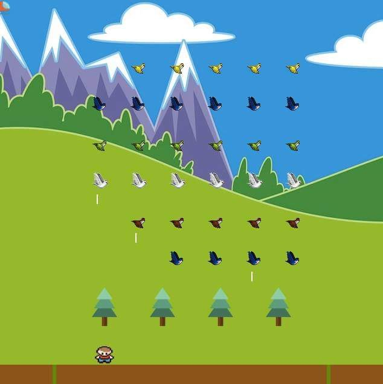

# Welcome to Marlena's GitHub Page

I'm a recent graduate of Saint Paul College with an AAS in Computer Programming/Web Development. Please check out some of my projects below. (Click on the image to view that project.)

## Resume

<a href="https://annamarlena.github.io/Resume_2.8.18.pdf">Marlena's Resume</a>

## H & H Contractors
A bilingual website I recently built for a Canadian client. 

## Travel Website
Made using Adobe Muse, for Graphical Web Design class.

## Wordpress Site
A Wordpress site I created for a fictional upscale restaurant. All visual content (images, etc) obtained through Creative Commons.

## Space Invaders Game
A simple Javascript game I made at Saint Paul College using Tumult Hype. This is a bird-themed variation of Space Invaders.

## Minesweeper Game
A simple Star Wars themed Javascript game I made at Saint Paul College using Tumult Hype.

## Portfolio Website
Made using Adobe Muse, this site is still under construction, with more content being added on a regular basis. 
I'm currently working on making this site responsive.

## Mr. Goldfish
A short animation I made using Adobe Animate.

## Bouncing Ball 
A brief animation depicting 4 of the 12 principles of animation: Squash & Stretch, Arcs, Ease In/Ease Out, and Exaggeration.

## Disco-Themed Slot Machine Game
A simple Javascript game I made at Saint Paul College using Tumult Hype. This is a disco-themed variation of a casino slot machine game. I had a lot of fun creating/editing images in GIMP. This game does load a bit slowly, but is worth the wait. Enjoy!

## An Early Website Project
A homework assignment for my first HTML/CSS class, and one of the first websites I built 100% from scratch. 
All photographs are my own. 

## Contact Me

annamarlena310@gmail.com  
763-234-2926

